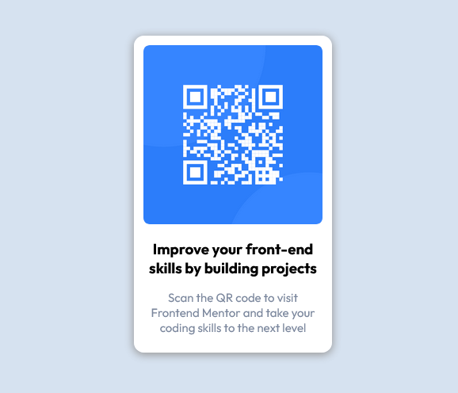

# Frontend Mentor - QR code component solution

This is a solution to the [QR code component challenge on Frontend Mentor](https://www.frontendmentor.io/challenges/qr-code-component-iux_sIO_H). Frontend Mentor challenges help you improve your coding skills by building realistic projects.

## Table of contents

- [Overview](#overview)
  - [Screenshot](#screenshot)
  - [Links](#links)
- [My process](#my-process)
  - [Built with](#built-with)
  - [What I learned](#what-i-learned)
  - [Continued development](#continued-development)
- [Author](#author)

## Overview

### Screenshot



### Links

- Solution URL: [Github](https://github.com/HectorKayman/QR-code-component)
- Live Site URL: [Live Site](https://hectorkayman.github.io/QR-code-component/)

## My process

### Built with

- Semantic HTML5 markup
- CSS3
- Flexbox

### What I learned

This is the Introductory challenge given by Frontend Mentor, so it was fairly simple to build.

Used sementic html elements where possible, instead of just putting `<div>` everywhere.

The following CSS property was useful in pushing the footer to the bottom, while keeping the main card in the centre, along with using flexbox.

```css
.container {
  margin: auto;
}
```

### Continued development

Would be looking into applying style for dark mode as well.

## Author

- Frontend Mentor - [@HectorKayman](https://www.frontendmentor.io/profile/HectorKayman)
